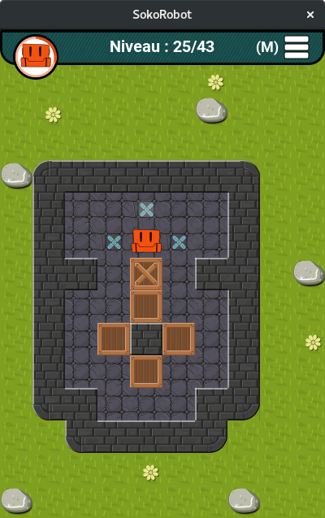

# SokoRobot
SokoRobot is a Sokoban game. It's written in langage C using SDL2.



The game is under the license: **GPLv2** , and all graphics are under Creative Commons : **CC BY-SA 4.0**

<a rel="license" href="http://creativecommons.org/licenses/by-sa/4.0/"></a><br />This work is licensed under a <a rel="license" href="http://creativecommons.org/licenses/by-sa/4.0/">Creative Commons Attribution-ShareAlike 4.0 International License</a>.


This is an early draft, use it carefully.
### Shortcuts
* m: menu
* n: next level
* p: previous level
* r: reset current level
* q: quit

### Dependencies
```
apt install build-essential git gettext fonts-roboto
apt install libsdl2-2.0-0 libsdl2-dev libsdl2-ttf-2.0-0 libsdl2-ttf-dev libfreetype6-dev libxml2-dev libsdl2-image-2.0-0 libsdl2-image-dev libsdl2-gfx-dev

```

### Download
```
git clone https://github.com/kaochen/SokoRobot
cd downloadfolder/SokoRobot
```
If you have already the project and you want to synchonize from the server :
```
git pull
```

### Compile
```
./configure
make
```

### Play
```
./src/SokoRobot
```

### Clean install
```
make clean
```


### Dev stuff
Use the develop branch to get the lastest commits:
```
git checkout develop
```


#### Create a new theme

add a new folder in SokoRobot/img/ ex: myTheme
add your images in it, keep the same name based on the original folder
img/original/box.png --> img/myTheme/box.png

change theme parameters in the preferences.ini file
theme = "original" --> theme = "myTheme"

If the program can't find a image in your theme folder, it will pick up one from the original folder.


#### Git :
```
git remote set-url origin git@github.com:kaochen/SokoRobot.git
git status // see changes
git diff //see changes as a patch
git add -u //update all existing files
git add new_files.c //add a new file or update en existing one
git mv file.c newfile.c
git rm file.c
git commit -m"new changesgit checkout -b"
git branch -b 'develop' //add a new branch
git push //push last commit
git pull //pull last changes
```

Good pratice:
 * [FR] http://emmanuel-delahaye.developpez.com/tutoriels/c/bonnes-pratiques-codage-c/

I used the "GNU Style" to indent my code.
```
apt get install indent
indent -gnu file.c
```
#### memory leak
```
apt install valgrind
valgrind --leak-check=yes --log-file=valgrind.log ./bin/SokoRobot
valgrind --leak-check=full --show-leak-kinds=all --log-file=valgrind.log ./bin/SokoRobot
```
#### Translate

Edit or add a file named "fr.po" in the "locale" folder (in french for example)
```
po/fr.po
```
Compile it:
```
msgfmt -o po/fr.mo po/fr.po
```
copy the .mo file into /usr/share/locale/
```
cp po/fr.mo /usr/share/locale/fr/LC_MESSAGES/sokorobot.mo
```
run SokoRobot
```
./SokoRobot
```
change langage from the terminal to test:
```
export LANG=en_EN.utf-8
```
or in french
```
export LANG=fr_FR.utf-8
```
### Links
 * http://wiki.libsdl.org/Installation#Linux.2FUnix
 * http://jeux.developpez.com/tutoriels/sdl-2/guide-migration/
 * http://www.meruvia.fr/index.php/big-tuto-sdl-1/179-big-tuto-sdl-1-2-chapitre-31-conversion-de-projet-vers-la-sdl-2
 * http://alexandre-laurent.developpez.com/tutoriels/sdl-2/afficher-sprites-sdl-2/
 * http://www.sokobano.de

